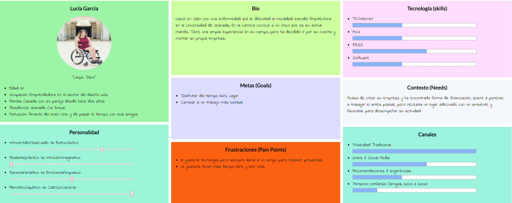
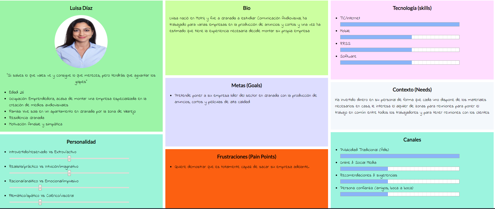
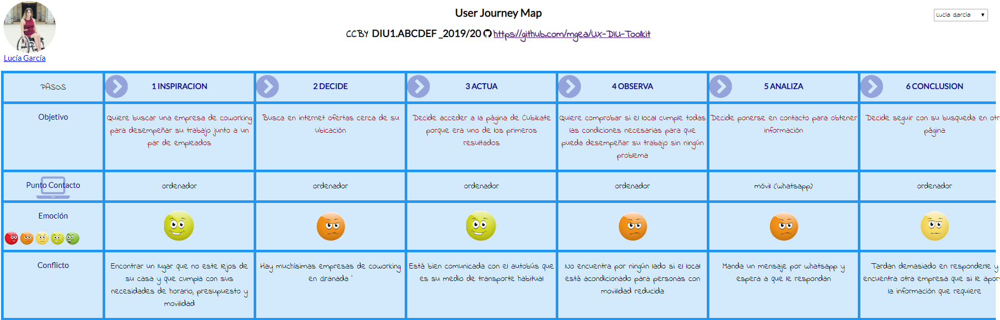
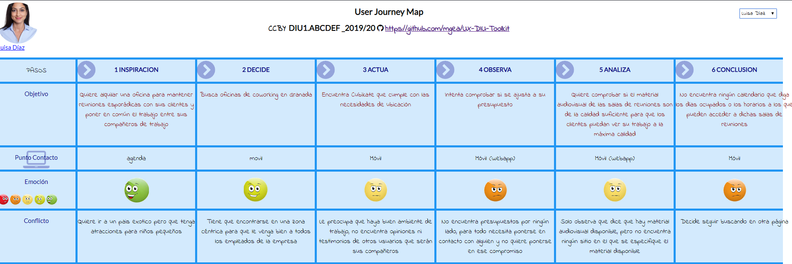
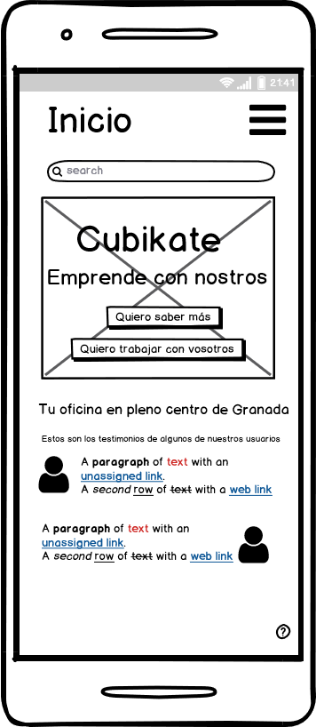
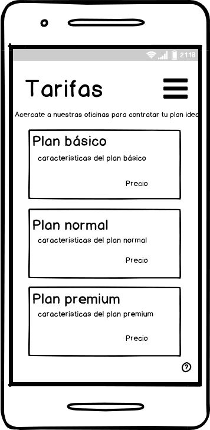
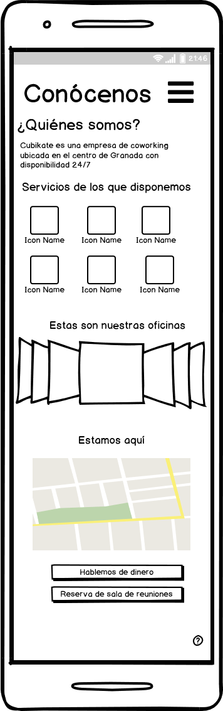
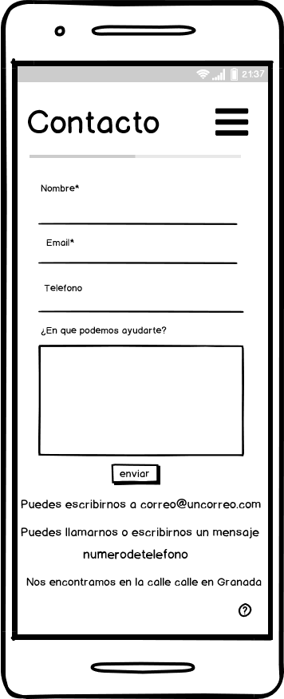
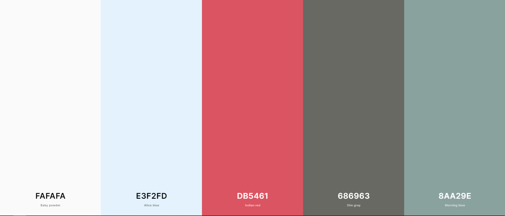

# Trabajo Final DIU
Repositorio para el trabajo final de la asignatura de Diseño de Interfaces de Usuario

Autor: Miguel Ángel Posadas Arraéz

----- 

En este trabajo estudiaremos un caso en el que se plantea el rediseño de una web para una empresa de coworking. En el enunciado del ejercicio se dan varias alternativas, he optado por analizar Cubikate https://cubikate.es/

Según la wikipedia, el coworking es una forma de trabajo que permite a profesionales independientes, emprendedores, y pymes de diferentes sectores, compartir un mismo espacio de trabajo, tanto físico como virtual, para desarrollar sus proyectos profesionales de manera independiente, a la vez que fomentan proyectos conjuntos.

## Paso 1. UX Desk Research & Analisis 

El primer paso para el rediseño de la web propuesta es analizar exhaustivamente la experiencia de usuario que ofrece la página con el objetivo de encontrar sus puntos fuertes y débiles, y una vez ahí empezar a trabajar para mejorar en los puntos en los que dicha página flaquea y potenciar aquellos en los que destaque.

_**1.a Competitive Analysis**_
Cubikate es una empresa dedicada al coworking que ofrece oficinas en pleno centro de Granada con una gran cantidad de servicios, las 24 horas del día. La he elegido porque tras un rápido vistazo he visto varias cosas que se pueden mejorar y porque la otra alternativa tiene problemas con el servidor y es dificilmente navegable.

_**1.b Personas**_

> Lucía representa a las personas con dificultades de movilidad que quieren alquilar una oficina para coworking.
Luisa representa a las personas que quieren alquilar un lugar para realizar reuniones, para las cuales necesitan un material muy concreto.

_**1.c User Journey Map**_

>He elegido el perfil de Lucía porque representa a las personas que tiene una movilidad reducida, por tanto necesita un local que se adapte perfectamente a sus necesidades. Por otro lado Luisa representa a un potencial cliente de este tipo de negocios, autónomos con presupuestos reducidos que acaban de empezar y para los cuales el costo es algo vital. Así como el material específico que necesitan y un horario muy concreto.

 

_**1.d Metas y puntos a evitar por los usuarios**_

A la hora de diseñar una web es fundamental identificar las metas que tienen los usuarios a la hora de elegir una empresa para coworking.

### Metas

- Los usuarios requieren de un local bien ubicado.
- Un local con un ambiente de trabajo óptimo para desempeñar su labor.
- Unos servicios de calidad (Internet estable, local climatizado, etc ...)
- Compañeros de trabajo en los que puedan encontrar oportunidades de negocio.

### Puntos a evitar

- Ambientes de trabajo inadecuados que les impidan realizar su trabajo
- Local mal comunicado con los medios de transporte
- Servicios de poca calidad o que no cumplan sus expectativas

 

_**1.e Usability Review**_

En general la página cuenta con varias deficiencias como lo son, carencia de buscador, falta de funcionalidad para reservar una sala de reuniones a través de la web, presupuestos y además contiene información redundante. Encontramos también páginas demasiado largas en las que se pierde mucho tiempo haciendo scroll.

Algo más que encontramos en la aplicación es la carencia de ayuda en línea simplemente un número al que se puede escribir por whatsapp o un correo electrónico al que escribir. No disponemos de un idioma alternativo ni información sobre accesibilidad.

Valoración numérica : 55 - Moderate

[Usability Review](ValoracionUsabilidad.pdf)

## Paso 2. UX Design  

_**2.a Feedback Capture Grid**_
----

| **Interesante**                                                                                                                                                                                                                                                     | **Críticas**                                                                                                                                                                                                                                                                                                                                                  |
|-----|-----|
|  Me parece interesante el hecho de que la barra de navegación te acompañe en cada momento durante la navegación en la web. Los iconos y la manera de representar los servicios de los que disponen las oficionas me parece un punto acertado porque es llamativa, amigable a la par que expresa toda la información necesaria. En todo momento se aprecia el icono para contactar a través de whatsapp| No aparece ninguna información relativa a las tarifas o al precio que costaría un alquiler de una sala de reuniones en un momento puntual.  No hay sección de preguntas frecuentes  No se puede consultar la página en ningún lenguaje alternativo.   En la pestaña inicio y en la pestaña coworking aparece exactamente la misma información                                                                    |
| 
**Preguntas**
                                                                                                                                                                                                                                 | 
**Nuevas ideas**
                                                                                                                                                                                                                                                                                                                       |
| ¿Se podría conocer información de las empresas que trabajan en el establecimiento para que nuevos usuarios puedan conocer el ambiente de trabajo que tendrían con sus futuros compañeros ? ¿Se podrían conocer con detalle el material técnico del que se dispone para empresas con necesidades específicas (calidad del proyector de la sala de reuniones, altavoces etc...)? ¿Se podría conocer la información de accesibilidad al local para personas con movilidad reducida (rampas, ascensor ...)? | Añadir un buscador para agilizar la navegación por el sitio Una galería bien hecha, que permita visualizar las imagenes en pantalla completa Un horario que muestre los días en los que las salas de reuniones u oficinas se encuentra en una ocupación inferior al aforo. Añadir una forma de reservar una sala de reuniones o entrar en la contratación del servicio.
 |

 > Como propuesta de valor se propone la creación de un sitio web que elimine la información redundante (ya que en varias pestañas del sitio actual aparece exactamente la misma información), mejor estructurada y añadiendo contenido para que aporte más información a los usuarios, como son una sección con tarifas o un apartado en el que aparezca que tipos de usuarios trabajan en el local ya que consideró fundamental para acceder a trabajar con una empresa de estas características conocer que personas van a estar en tu ambiente laboral. También se proponen páginas más cortas para facilitar la navegación y la inclusión de un buscador para agilizar la misma. Finalmente se añade la funcionalidad de poder reservar una sala de reuniones o de acceder a trabajar con la empresa de coworking a través de la propia página.

 

 _**2.b Wireframes**_

Una vez realizado un exhaustivo análisis de la página, en busca de sus puntos malos y sus ventajas he realizado una serie de wireframes o bocetos de lo que sería el diseño de la web solventando algunos de los problemas que he encontrado.

 

 

[Aquí puedes consultar todos los bocetos](img/Wireframes)

### Patrones de Diseño y Guidelines

Es importante el uso de una tipografía que sea legible, a la par de que muestre cierta seriedad para demostrar seriedad, se utilizará Roboto.

Para la realización de los wireframes se han tenido en cuenta varios patrones de diseño como son los siguientes :

Debido a que se trata de una interfaz móvil se ha utilizado *Call-to-Action Buttons*, ya que es fundamental que el usuario sepa en todo momento cuáles son las funciones que puede realizar. En los formularios (tanto en el de contacto como en el de reserva de sala de reuniones he utilizado) he utilizado el patrón conocido como *Progress Trackers*, ya que cuando un usuario realiza una acción en el sistema es fundamental que reciba una realimentación en cada momento para que conozca el progreso que lleva realizado en esa acción, y cuanto porcentaje le queda por realizar para terminar la tarea que está realizando.

 

 

Relacionado con una de las desventajas y parte negativa que encontrabamos en el análisis, hemos usado una barra de búsqueda la cual llevará a una página de resultados bien diseñada, cumpliendo con el patrón *Search Results Design*, ya que cuando un usuario realiza una búsqueda espera que le ayude, remarcando los contenidos que más se asemejan con su búsqueda y los cuáles son más relevantes para el.

En el diseño de escritorio se utilizará el patrón *breadcrumb* ya que es muy importante que el usuario sepa en todo momento en que lugar de la página se encuentra. Para la parte movil lo que se ha utilizado para esto es el nombre de la página arriba junto a la barra de navegación.

En cuanto a los *Guidelines* se ha seguido el Material Design de Google, se han tenido varios factores en cuenta, mostrar los partados de la página a través de etiquetas, de forma que el usuario pueda acceder a través de ellas (Inicio, Contacto, FAQs, Conócenos ...). Durante la implementación se mantendrá especial cuidado en que se pueda volver atrás en cada momento. Se prestará especial cuidado para que la transición entre web y la aplicación se haga sin problemas ya que es fundamental para funciones como el pago de la reserva (Pago para el que se propondrán la mayor cantidad de formas de pago posibles).

En cuanto a la paleta de colores se utilizará la siguiente que ha sido generada a través de la siguiente herramienta: https://coolors.co/

El objetivo de elegir estas tonalidades pastel es para que el usuario se sienta cómodo navegando por la web y esto le inspire la confianza de que se va a sentir cómodo trabajando en el ámbiente que ofrece Cubikate.

## Paso 3. Análisis de usabilidad

Como ya he comentado anteriormente, uno de los puntos en los que queremos hacer hincapié en este rediseño de la página es en el tema de de accesibilidad, tanto la accesibilidad de la página en sí, como mostrando información de la accesibilidad de la que dispone el local mostrando como servicios los detalles de los que se disponen (ascensor, rampas,  etc ...)

 _**3.a Evaluación de accesibilidad**_

 Para la evaluación de accesibilidad utilizaré una plantilla que ya hemos utilizado anteriormente en la asignatura, [aquí puedes consultar el análisis](img/PlantillaAccesibilidad.jpeg). 

 En el análisis se ha comprobado si se cumplen las pautas de WCAG, para ello he utilizado varias herramientas como lo son: https://wave.webaim.org/  y Accessibility Insights for Web (esta última es un pluggin para Google Chrome).

 Las conclusiones a las que se ha llegado tras el análisis son que la página carece de información de accesibilidad, para el rediseño es importante incorporarla, así como solventar algunos problemas graves que lastran la accesibilidad del sitio web, como lo son los problemas de contraste que perjudican enormente a las personas que sufren de acromatopsia, además las imágenes carecen de texto alternativo para que personas con problemas de visión puedan navegar por el sitio y ningún formulario tiene etiquetas lo que perjudica enormente en la compresión del sentido de los formularios.